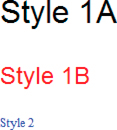

# Manipulating an HTML stylesheet from ActionScript

Once the HTMLLoader object has dispatched the `complete` event, you can examine
and manipulate CSS styles in a page.

For example, consider the following simple HTML document:

```
<html>
<style>
	.style1A { font-family:Arial; font-size:12px }
	.style1B { font-family:Arial; font-size:24px }
</style>
<style>
	.style2 { font-family:Arial; font-size:12px }
</style>
<body>
	<p class="style1A">
		Style 1A
	</p>
	<p class="style1B">
		Style 1B
	</p>
	<p class="style2">
		Style 2
	</p>
</body>
</html>
```

After an HTMLLoader object loads this content, you can manipulate the CSS styles
in the page via the `cssRules` array of the `window.document.styleSheets` array,
as shown here:

```
var html:HTMLLoader = new HTMLLoader();
var urlReq:URLRequest = new URLRequest("test.html");
html.load(urlReq);
html.addEventListener(Event.COMPLETE, completeHandler);
function completeHandler(event:Event):void {
	var styleSheet0:Object = html.window.document.styleSheets[0];
	styleSheet0.cssRules[0].style.fontSize = "32px";
	styleSheet0.cssRules[1].style.color = "#FF0000";
	var styleSheet1:Object = html.window.document.styleSheets[1];
	styleSheet1.cssRules[0].style.color = "blue";
	styleSheet1.cssRules[0].style.font-family = "Monaco";
}
```

This code adjusts the CSS styles so that the resulting HTML document appears
like the following:



Keep in mind that code can add styles to the page after the HTMLLoader object
dispatches the `complete` event.
